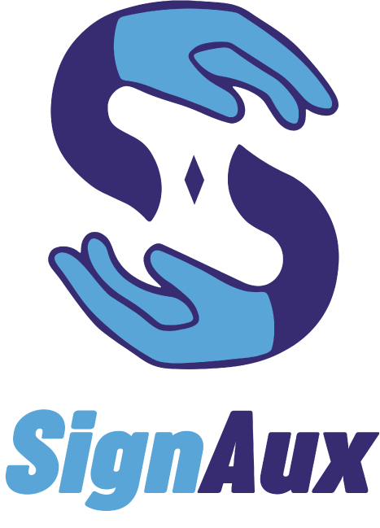

Este projeto de Trabalho de Conclusão de Curso (TCC) é dedicado ao desenvolvimento de uma aplicação inovadora que tem como objetivo principal transcrever a Língua Brasileira de Sinais (Libras) para texto escrito.

A proposta busca contribuir significativamente para a inclusão social e a comunicação entre surdos e ouvintes, oferecendo uma ferramenta que facilita a compreensão e a interação em ambientes diversos.

Acreditamos que esta aplicação tem o potencial de transformar a maneira como as pessoas surdas interagem com o mundo ao seu redor, quebrando barreiras de comunicação e promovendo uma sociedade mais inclusiva e acessível para todos.

[Sobre o projeto](#)
